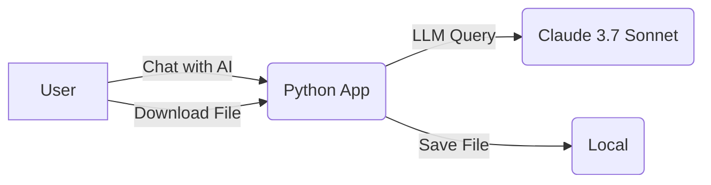
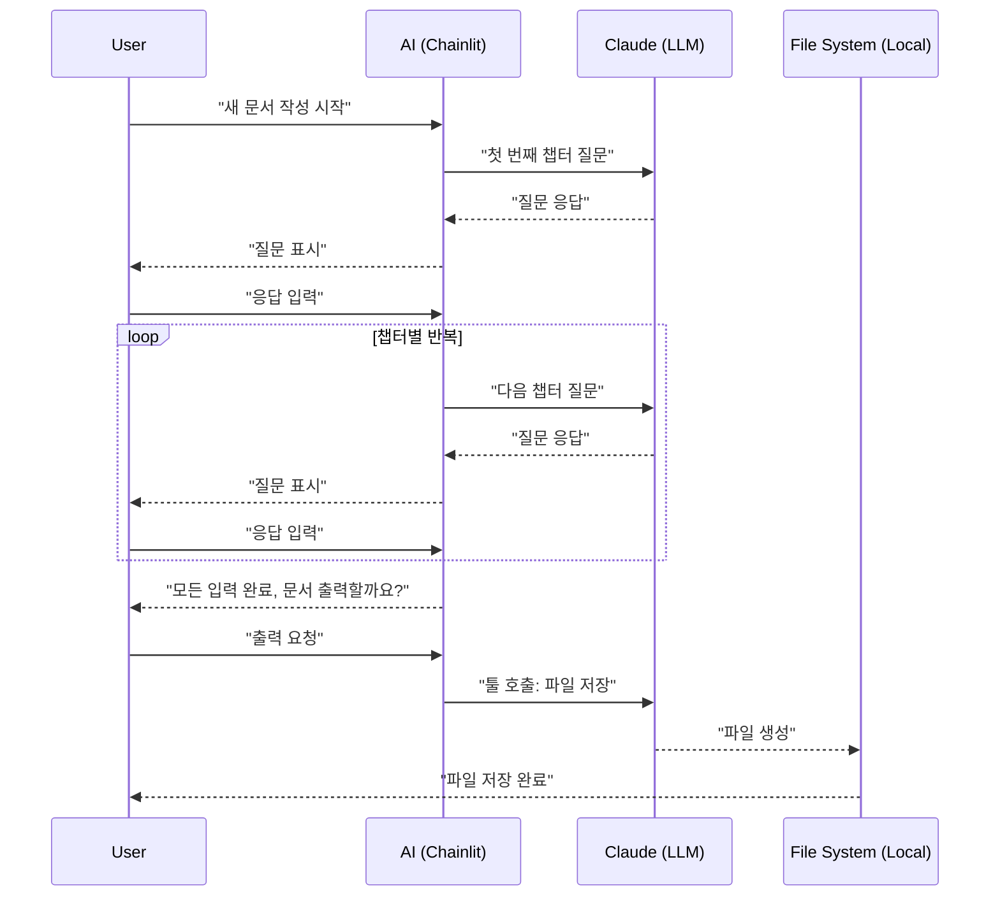

# ALPS Writer Specification Document

## 1. Overview

### 1.1 Purpose

- 사용자가 AI와 대화하며 기술/기능 사양 문서를 자동 생성할 수 있도록 지원한다.
- 개발자, 제품 매니저, 기획자 등이 보다 효율적으로 MVP 기술 스펙을 작성할 수 있도록 한다.

### 1.2 Document Title

- ALPS(Agentic Lean Prototyping Spec) Writer

### 1.3 Author

- haandol <ldg55d@gmail.com>

### 1.4 Change History

```md
- 2025-01-31: Initial draft
```

---

## 2. MVP Goal & Metrics

### 2.1 Purpose

- AI가 주어진 템플릿 기반으로 사용자의 입력을 반영하여 기술 사양 문서를 빠르게 생성할 수 있는가?

### 2.2 Key Metrics (KPI)

- 사용자가 AI를 통해 문서를 완성하는 평균 시간: **30분 이하**

---

## 3. Requirements Summary

### 3.1 Functional Requirements (기능 요구사항)

- **F1: 템플릿 기반 AI 문서 작성**

  - 미리 지정된 템플릿을 기반으로 AI가 사용자 입력을 반영하여 문서를 생성한다.

- **F2: 대화형 입력 지원**

  - 사용자가 AI와 대화하며 단계적으로 문서를 채워갈 수 있도록 한다.

- **F3: 문서 다운로드 기능**

  - 작성된 문서를 Markdown (`.md`) 형식으로 다운로드할 수 있어야 한다.

- **F4: 기존 문서 불러오기 및 편집**

  - 이전에 작성한 문서를 불러와 AI와 함께 추가 편집할 수 있다.

- **F5: 대형 템플릿 분할 처리 및 순차적 출력**

  - 템플릿이 크기 때문에 한 번에 출력하는 것이 아니라, 챕터별로 루프를 돌며 순차적으로 파일에 저장한다.

- **F6: 웹 검색 기능**
  - `/search` 명령어를 통해 실시간 웹 검색 결과를 대화에 반영할 수 있다.
  - Tavily API를 사용하여 관련성 높은 검색 결과를 제공한다.

### 3.2 Non-Functional Requirements (비기능 요구사항)

- **NF1: 성능**

  - 1,000명의 동시 사용자를 지원해야 한다.
  - 문서 생성 속도는 30초 이내여야 한다.

---

## 4. High-Level Architecture

### 4.1 Simple System Diagram

초기 MVP는 **Python Chainlit**을 사용하여 프론트엔드와 백엔드를 통합 처리하며, **Amazon Bedrock의 Claude 3.7 Sonnet**를 활용해 AI와 대화하며 문서를 생성합니다. 생성된 문서는 **로컬 파일(`.md`)로 저장**됩니다.



### 4.2 Technology Stack

| 구성 요소               | 기술 스택                                                        |
| ----------------------- | ---------------------------------------------------------------- |
| **프론트엔드 & 백엔드** | Python (Chainlit)                                                |
| **LLM API**             | Amazon Bedrock, Langchain                                        |
| **LLM Model**           | Claude Sonnet 3.7 (us.anthropic.claude-3-7-sonnet-20250219-v1:0) |
| **웹 검색 API**         | Tavily API                                                       |
| **파일 저장**           | 로컬 파일 (`.md`) 저장                                           |
| **배포 환경**           | 로컬 실행 (MVP 1단계), 이후 ECS 배포 예정                        |

---

## 5. Design Specification

### 5.1 Screen Structure & User Flow

#### 5.1.1 Key Screens (Pages)

- **챗봇 인터페이스** (ChatGPT 스타일)
  - 사용자가 AI와 대화하며 문서를 작성하는 화면

#### 5.1.2 User Flow

1. 사용자가 "새 문서 작성"을 시작
2. AI가 템플릿의 각 챕터별 질문을 하며 단계별 입력을 유도
3. 사용자가 응답 입력
4. AI가 "이대로 진행할까요?"라고 확인 요청
5. 사용자가 확인하면 다음 챕터로 진행
6. 모든 챕터를 완료하면 "출력할까요?"라고 확인 요청
7. 사용자가 확인하면 `.md` 파일로 저장



### 5.2 Out of Scope (이번 MVP에서 제외)

- **S3 업로드 기능** → 다음 MVP에서 처리
- **ECS 배포** → 현재는 로컬 실행, 이후 ECS 배포 예정

---

## 6. Feature-Level Specification

본 섹션에서는 Section 3.1의 각 핵심 기능(Fx)에 대해 사용자 시나리오, UI 플로우, 기술적 구현 세부사항, (필요 시) API 사양 등을 명시합니다.

### 6.1 Feature A (F1: 템플릿 기반 AI 문서 작성)

#### 6.1.1 User Story

- 사용자가 "새 문서 작성"을 선택하면, AI가 미리 정의된 템플릿에 따라 각 챕터별 질문을 제시합니다.
- 사용자는 질문에 답변을 입력하고, "이대로 진행할까요?"라는 확인을 거쳐 다음 챕터로 이동합니다.
- 모든 챕터 입력 완료 후, 문서 저장 기능(F5)을 호출하여 최종 결과물을 `.md` 파일로 생성합니다.

#### 6.1.2 UI Flow

1. 사용자가 "새 문서 작성" 버튼 클릭
2. AI가 첫 번째 챕터 질문을 제시
3. 사용자가 답변 입력
4. AI가 "이대로 진행할까요?" 확인 메시지 출력
5. 사용자가 확인 후 다음 챕터로 진행 (챕터별 반복)
6. 모든 챕터 완료 후 "출력할까요?" 확인 메시지 출력
7. 확인 시, F5 기능 호출하여 파일 저장 및 다운로드 링크 제공

#### 6.1.3 Technical Description

- **질문 생성:**
  - 미리 정의된 템플릿과 ALPS 컨텍스트(F6)를 바탕으로 LLM에 각 챕터 질문 요청
- **응답 처리:**
  - 사용자 입력을 받아 내부 데이터 구조(예: 메모리 객체)에 저장
  - 각 챕터별로 "확인" 과정을 통해 수정 가능하도록 함
- **문서 생성:**
  - 최종 챕터까지 완료되면 저장 기능(F5)을 호출하여 모든 챕터 내용을 하나의 Markdown 문자열로 결합
- **오류 처리:**
  - LLM 응답 실패, 사용자 입력 누락 등 오류에 대해 적절한 에러 메시지 출력

### 6.2 Feature B (F2: 대화형 입력 지원)

#### 6.2.1 User Story

- 사용자는 챗봇 인터페이스 내에서 각 챕터별 답변을 직접 입력할 수 있습니다.
- AI는 LLM을 활용해 적절한 질문을 자동 생성하며, 모호한 답변에 대해 추가 질문을 던져 보완하도록 유도합니다.

#### 6.2.2 UI Flow

1. AI가 각 챕터별 질문을 자동 생성하여 화면에 출력
2. 사용자가 답변 입력 필드에 내용을 입력
3. 전송 후, AI가 입력 내용을 검토하고 필요 시 추가 질문을 제시
4. 사용자가 추가 입력 후 확인 메시지를 통해 챕터 완료 처리

#### 6.2.3 Technical Description

- **입력 캡처:**
  - Chainlit의 대화형 입력 이벤트 리스너를 통해 사용자의 텍스트 입력을 실시간으로 수집
- **LLM 연동:**
  - 입력 내용을 기반으로 LLM 호출 시 추가 질문 혹은 보완 요청을 수행
- **상태 관리:**
  - 각 챕터별 응답을 별도의 상태 변수에 저장하여 누락 없이 관리
- **에러 및 검증:**
  - 빈 입력 혹은 비정상 입력에 대해 즉각적인 재요청 메시지 출력

### 6.3 Feature C (F3: 문서 다운로드 기능)

#### 6.3.1 User Story

- 최종 생성된 문서를 사용자가 `.md` 파일 형식으로 다운로드할 수 있도록 합니다.
- 저장된 파일은 UI 내 다운로드 링크를 통해 제공됩니다.

#### 6.3.2 UI Flow

1. 모든 챕터 입력 완료 후, "출력할까요?" 확인 메시지 출력
2. 사용자가 확인하면 F5 기능을 통해 `.md` 파일 생성
3. 파일 생성 후, UI에 다운로드 버튼 또는 링크가 표시됨
4. 사용자가 해당 링크를 클릭하여 파일 다운로드

#### 6.3.3 Technical Description

- **파일 생성:**
  - F5에서 생성된 Markdown 문자열을 지정된 경로(`./output/`)에 저장
  - 파일명은 `output-[RFC3339].md` 형식으로 생성
- **다운로드 제공:**
  - UI 내 파일 경로 또는 파일 스트림을 제공하여 사용자가 파일을 받을 수 있도록 처리
- **오류 처리:**
  - 파일 생성 실패 또는 저장 경로 오류 발생 시, 에러 메시지를 출력하고 재시도 유도

### 6.4 Feature D (F4: 기존 문서 불러오기 및 편집)

#### 6.4.1 User Story

- 사용자는 기존에 작성된 `.md`, `.json`, 또는 `.pdf` 파일을 불러와 AI와 함께 편집할 수 있습니다.
- 또한, 이미지 파일(`.jpg`, `.jpeg`, `.png`, `.gif`, `.webp`) 업로드를 통해 추가 자료를 제공받을 수 있습니다.
- AI는 불러온 문서를 분석하고, 추가 질문을 통해 보완을 유도합니다.

#### 6.4.2 UI Flow

1. UI 상의 "불러오기" 버튼 클릭
2. 파일 선택 다이얼로그를 통해 파일 선택
3. 선택된 파일의 내용이 화면에 로드되어 표시됨
4. AI가 불러온 내용을 분석하여 대화 컨텍스트에 추가
5. 사용자가 기존 내용에 대해 수정 및 추가 입력

#### 6.4.3 Technical Description

- **파일 입력 처리:**
  - 파일 선택 및 업로드를 위한 파일 입력(form) 요소 사용
  - 파일 확장자 검증 및 지원 파일 형식에 대한 파싱 처리
- **내용 파싱 및 표시:**
  - 텍스트 파일(`.md`, `.json`)은 텍스트 파싱, `.pdf`는 OCR 또는 PDF 파서 사용
  - 이미지 파일의 경우, 미리보기 기능 제공 및 필요 시 OCR 처리(추후 확장)
- **에러 처리:**
  - 지원하지 않는 파일 형식일 경우 사용자에게 오류 메시지 출력

### 6.5 Feature E (F5: 문서 저장 기능)

#### 6.5.1 User Story

- 사용자가 모든 챕터 입력을 완료하면, AI가 완성된 문서를 S3에 저장합니다.
- 저장된 파일은 presigned URL을 통해 안전하게 다운로드할 수 있습니다.
- 파일 저장은 챕터별로 순차적으로 처리하여 LLM의 출력 토큰 한계를 극복합니다.

#### 6.5.2 UI Flow

1. 모든 챕터 입력 완료 후 "출력할까요?" 확인 메시지 출력
2. 확인 시, 내부적으로 각 챕터별 내용이 결합되어 S3 업로드 요청
3. S3 업로드 완료 후, presigned URL이 생성되어 Chainlit UI 요소로 다운로드 링크 표시

#### 6.5.3 Technical Description

- **내용 결합:**
  - 내부 데이터 구조에 저장된 각 챕터의 텍스트를 순차적으로 결합하여 하나의 문자열로 생성
- **S3 저장:**
  - `save_to_s3(bucket_name, user_id, content)` 함수 호출
  - 파일 경로: `{bucket_name}/{user_id}/{RFC3339}.md` 형식으로 저장
- **Presigned URL 생성:**
  - `generate_presigned_url(bucket_name, file_path)` 함수로 임시 다운로드 URL 생성
  - URL 유효 기간: 24시간으로 설정
- **UI 표시:**
  - Chainlit의 `cl.Message`와 `cl.File` 요소를 사용하여 다운로드 링크 표시
- **오류 처리:**
  - S3 업로드 실패 시 재시도 로직 구현
  - Presigned URL 생성 실패 시 사용자에게 오류 메시지 출력

#### 6.5.4 API Specification

| Tool Name                | Functionality      | Input Parameters                                   | Output                                  |
| ------------------------ | ------------------ | -------------------------------------------------- | --------------------------------------- |
| `save_to_s3`             | S3 파일 업로드     | `{ bucket_name: str, user_id: str, content: str }` | `{ success: bool, file_path: str }`     |
| `generate_presigned_url` | Presigned URL 생성 | `{ bucket_name: str, file_path: str }`             | `{ success: bool, presigned_url: str }` |

### 6.6 Feature F (F6: ALPS 컨텍스트 제공)

#### 6.6.1 User Story

- AI는 대화 시작 시 `ALPS.md` 파일을 읽어 시스템 프롬프트의 컨텍스트로 활용합니다.
- 이를 통해 AI는 ALPS 문서 작성 방법론에 대한 배경 지식을 갖추고, 보다 적절한 질문과 응답을 제공할 수 있습니다.

#### 6.6.2 UI Flow

- **초기 로딩:**
  - Chainlit 앱이 시작될 때 백그라운드에서 `./templates/ALPS.md` 파일을 읽어와 내부 변수에 저장
  - 별도의 UI 상의 노출은 없으나, 시스템 로그에 로딩 상태가 기록됨

#### 6.6.3 Technical Description

- **파일 로딩:**
  - 애플리케이션 시작 시 한 번만 `ALPS.md` 파일을 읽어 메모리에 로드
- **시스템 프롬프트 주입:**
  - LLM 호출 시, 시스템 프롬프트 템플릿에 ALPS 컨텍스트를 포함시켜 요청
- **오류 처리:**
  - 파일이 누락되거나 읽기 오류 발생 시, 경고 로그 출력 및 기본 프롬프트 사용

### 6.7 Feature G (F7: 웹 검색 기능)

#### 6.7.1 User Story

- 사용자는 `/search [검색어]` 명령어를 통해 실시간 웹 검색을 요청할 수 있습니다.
- AI는 Tavily API를 통해 최대 5개의 관련 검색 결과(제목, URL, 요약)를 받아 대화 컨텍스트에 반영합니다.

#### 6.7.2 UI Flow

1. 사용자가 채팅 입력란에 `/search [검색어]` 명령어 입력
2. 시스템이 명령어를 인식하고, 검색어를 추출
3. 내부적으로 `web_search(query)` 함수 호출
4. Tavily API로부터 검색 결과를 수신
5. 결과를 포맷하여 채팅 창에 출력 및 대화 흐름에 통합

#### 6.7.3 Technical Description

- **명령어 파싱:**
  - 채팅 입력에서 `/search` 명령어와 뒤따르는 검색어를 추출
- **API 연동:**
  - `web_search(query)` 함수를 통해 Tavily API 호출 및 결과 수신
- **결과 처리:**
  - 최대 5개의 결과를 제목, URL, 요약 정보와 함께 정렬하여 반환
- **오류 처리:**
  - API 호출 실패, 결과 없음 등의 상황에 대해 적절한 메시지를 출력

#### 6.7.4 API Specification

| Tool Name    | Functionality | Input Parameters | Output                                   |
| ------------ | ------------- | ---------------- | ---------------------------------------- |
| `web_search` | 웹 검색       | `{ query: str }` | `{ results: List[Dict], success: bool }` |

### 6.8 Feature H (F8: 문서 출력 캐싱 기능)

#### 6.8.1 User Story

- 사용자가 작성 중인 ALPS 문서의 특정 챕터 또는 전체 문서를 요청할 때 토큰 제한 문제를 방지합니다.
- 챕터별 출력 내용을 히스토리와 분리하여 별도 저장소에 캐싱함으로써 대화 컨텍스트의 효율성을 유지합니다.
- 사용자는 최신 상태의 문서를 언제든지 볼 수 있으며, 이미 출력된 챕터의 내용이 대화 히스토리에 중복되지 않습니다.

#### 6.8.2 UI Flow

1. 사용자가 "현재 문서 보기" 또는 특정 챕터 확인을 요청
2. 시스템이 LLM을 통해 Langchain Tool을 호출하여 요청된 챕터 또는 전체 문서를 생성
   - 전체 문서 요청 시, 챕터를 순차적으로 출력
3. 생성된 내용을 별도의 딕셔너리(`document_cache`)에 저장
4. 생성 요청시 내용을 Chainlit UI를 통해 표시하되, 이 출력은 대화 히스토리에 포함되지 않음
5. 사용자가 최종 문서 저장 요청 시, 캐시된 최신 버전을 사용하여 파일로 저장

#### 6.8.3 Technical Description

- **Langchain Tool 구현:**

  - Langchain의 `Tool` 클래스를 활용하여 문서 캐싱 및 출력 관련 도구 구현
  - llm_cowriter 에서 `bind_tools` 을 사용하여 대화식으로 진행하는 중에 문서를 저장 툴 호출여부를 확인
    - 사용자가 챕터 생성이나, 출력을 요청하면 항상 `update_cache_tool` 을 사용하여 챕터를 생성
    - 해당 챕터생성 결과는 히스토리에 포함되지 않으나 Chainlit UI 에는 표시됨

- **캐싱 메커니즘:**

  - 내부적으로 `document_cache` 딕셔너리를 유지하여 각 챕터별 최신 출력 내용을 저장
  - 상태 유지를 위해 해당 딕셔너리는 채팅이 시작될 때 Chainlit 의 user_session 에 저장하여 사용
  - 키: 챕터 ID(예: "chapter_1", "chapter_2"), 값: 해당 챕터의 최신 출력 텍스트

- **문서 저장 연동:**

  - F5(문서 저장 기능) 호출 시 대화 히스토리 대신 `document_cache`에서 최신 내용을 사용
    - 호출시 처음에 캐시 내용을 무시하고 모든 챕터를 새로 생성할지 사용자에게 확인을 받는다.
  - 이를 통해 토큰 제한에 구애받지 않고 완전한 문서 저장 가능

#### 6.8.4 API Specification

| Tool Name      | Functionality               | Input Parameters      | Output                     |
| -------------- | --------------------------- | --------------------- | -------------------------- |
| `update_cache` | 챕터 문서 생성 및 캐시 갱신 | `{ chapter_id: str }` | `{ chapter_content: str }` |

---

## 7. Data Model (데이터 모델)

### 7.1 파일 저장 구조

- **저장 경로:** `./output/`
- **파일명 규칙:** `output-[RFC3339].md`
  - 예) `output-2025-01-31T12:34:56Z.md`

### 7.2 데이터 저장 방식

| 데이터 유형        | 저장 위치       | 설명                                 |
| ------------------ | --------------- | ------------------------------------ |
| 문서 데이터        | `.md` 파일      | 최종 완성된 문서                     |
| 기존 문서 불러오기 | `.md` 파일 로드 | 사용자가 직접 파일을 선택하여 불러옴 |

---

## 8. API Endpoint Specification (해당 MVP에서는 API 없음)

- Chainlit 내부에서 `save_md_file()` 및 `load_md_file()` 함수를 직접 호출하여 처리
- 다음 MVP에서 API 형태로 확장 가능

---

## 9. Deployment & Operation (배포 및 운영)

### 9.1 Deployment Method (배포 방식)

- 이번 MVP에서는 **로컬 실행** 방식으로 운영
- 실행 방법:

  ```bash
  chainlit run main.py
  ```

- 다음 MVP에서 ECS 배포 고려

### 9.2 Basic Monitoring (기본 로깅 및 에러 처리)

- **로깅:** Chainlit 기본 로그 활용
- **에러 로그 저장:** `error.log` 파일에 주요 오류 기록

---

## 10. MVP Metrics (MVP 성과 측정)

### 10.1 Data to Collect (수집할 데이터)

- **평균 문서 작성 시간** (사용자가 문서를 시작하고 최종 저장할 때까지 걸린 시간)
- **챕터별 입력 수정 횟수** (사용자가 한 챕터에서 몇 번 입력을 수정했는지)

### 10.2 Data Collection Method (데이터 수집 방법)

- Chainlit 로그에 기록
- 이후 `grep` 등을 활용하여 분석

**로그 예시:**

```log
[INFO] 문서 작성 시작: 2025-01-31T12:00:00Z
[INFO] 챕터 1 입력 완료 (수정 횟수: 2)
[INFO] 챕터 2 입력 완료 (수정 횟수: 0)
[INFO] 최종 문서 저장: 2025-01-31T12:20:30Z
[INFO] 총 작성 시간: 20분 30초
```

---

## 11. Out of Scope (이번 MVP에서 제외)

- **S3 업로드 기능** → 다음 MVP에서 처리
- **ECS 배포** → 현재는 로컬 실행, 이후 ECS 배포 예정
- **API 제공** → 현재는 Chainlit 내부 함수 호출 방식 사용, 이후 API 확장 고려
