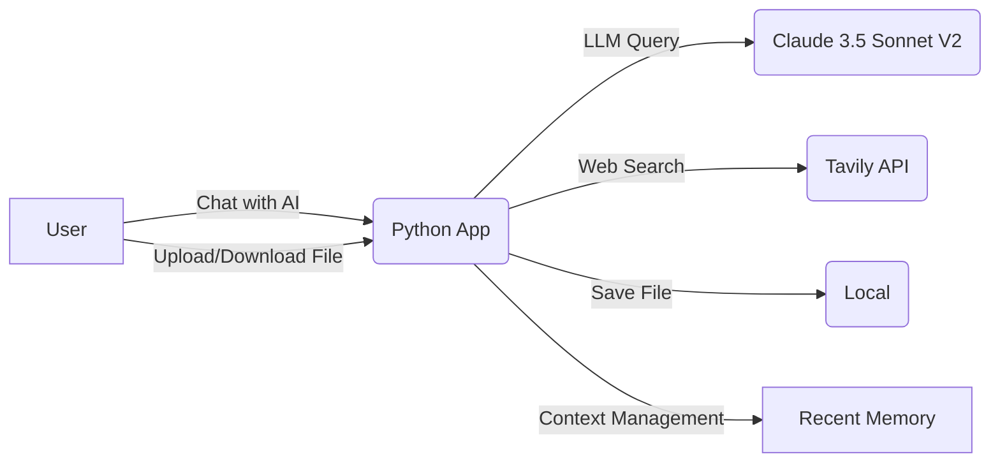
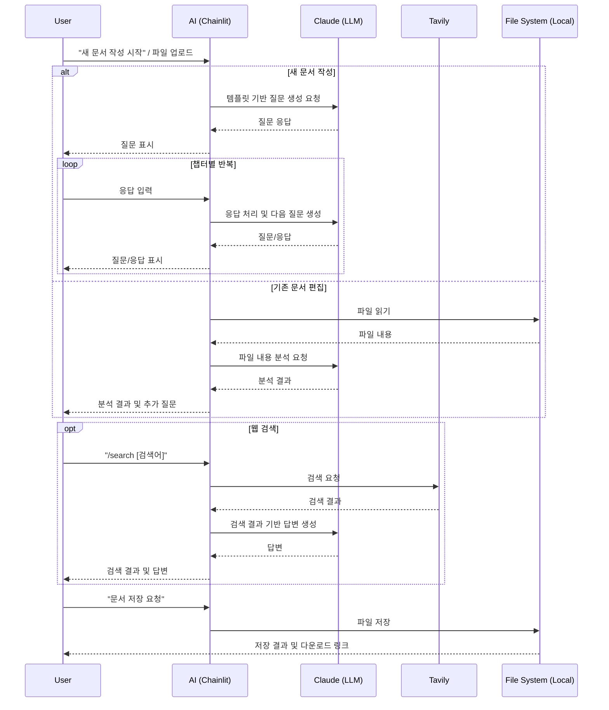

# ALPS Writer 사양서

## 1. 개요

### 1.1 목적

- 사용자가 AI와 대화하며 기술/기능 사양 문서를 자동 생성할 수 있도록 지원
- 개발자, 제품 매니저, 기획자 등이 보다 효율적으로 MVP 기술 스펙을 작성할 수 있도록 함

### 1.2 문서 제목

- ALPS(Agentic Lean Prototyping Spec) Writer

### 1.3 작성자

- haandol <ldg55d@gmail.com>

### 1.4 변경 이력

```md
- 2025-01-31: 초기 초안 작성
- 2025-03-05: 현재 구현 상태 반영 업데이트
- 2025-03-20: 메모리 관리 시스템 추가 및 기능 업데이트
```

---

## 2. MVP 목표 및 지표

### 2.1 목적

- AI가 주어진 템플릿 기반으로 사용자의 입력을 반영하여 기술 사양 문서를 빠르게 생성할 수 있는가?
- 사용자와 AI의 대화 컨텍스트를 효과적으로 유지하며 문서를 작성할 수 있는가?

### 2.2 핵심 지표 (KPI)

- 사용자가 AI를 통해 문서를 완성하는 평균 시간: **30분 이하**
- 대화 컨텍스트 유지율: **90% 이상**

---

## 3. 요구사항 요약

### 3.1 기능 요구사항

- **F1: 템플릿 기반 AI 문서 작성**
  - 미리 지정된 ALPS 템플릿을 기반으로 AI가 사용자 입력을 반영하여 문서를 생성
  - 벡터 메모리와 최근 메모리를 활용한 대화 컨텍스트 관리

- **F2: 대화형 입력 지원**
  - 사용자가 AI와 대화하며 단계적으로 문서를 채워갈 수 있도록 지원
  - 스트리밍 방식의 실시간 응답 제공

- **F3: 문서 다운로드 기능**
  - 작성된 문서를 Markdown (`.md`) 형식으로 다운로드할 수 있음

- **F4: 기존 문서 불러오기 및 편집**
  - 이전에 작성한 문서(`.md`, `.json`, `.pdf`) 및 이미지 파일(`.jpg`, `.jpeg`, `.png`, `.gif`, `.webp`)을 불러와 AI와 함께 추가 편집 가능
  - 멀티모달 입력 지원으로 이미지 컨텍스트 활용

- **F5: 웹 검색 기능**
  - `/search` 명령어를 통해 실시간 웹 검색 결과를 대화에 반영 가능
  - Tavily API를 사용하여 관련성 높은 검색 결과 제공

- **F6: 문서 저장 기능**
  - `/save local` 명령어를 통해 현재까지 작성된 문서를 로컬 파일 시스템에 저장
  - 프롬프트 캐싱을 활용하여 효율적으로 문서 생성
  - 생성 과정은 단계별로 표시하되, 최종 결과만 대화 히스토리에 영향을 미치지 않도록 처리

### 3.2 비기능 요구사항

- **NF1: 성능**
  - 1,000명의 동시 사용자 지원
  - 문서 생성 속도는 30초 이내여야 함
  - 메모리 관리 시스템을 통한 효율적인 컨텍스트 유지

- **NF2: 보안**
  - AWS Cognito를 통한 OAuth 인증 지원 (개발 환경에서는 비활성화 가능)
  - DynamoDB를 사용한 대화 히스토리 저장
  - 환경 변수를 통한 민감 정보 관리

---

## 4. 고수준 아키텍처

### 4.1 시스템 구성도

초기 MVP는 **Python Chainlit**을 사용하여 프론트엔드와 백엔드를 통합 처리하며, **Amazon Bedrock의 Claude 3.5 Sonnet V2**을 활용해 AI와 대화하며 문서를 생성합니다. 생성된 문서는 **로컬 파일(`.md`)로 저장**됩니다. 대화 컨텍스트는 **벡터 메모리**와 **최근 메모리**를 통해 관리됩니다.



### 4.2 기술 스택

| 구성 요소               | 기술 스택                                                        |
| ----------------------- | ---------------------------------------------------------------- |
| **프론트엔드 & 백엔드** | Python (Chainlit)                                                |
| **LLM API**             | Amazon Bedrock, Langchain                                        |
| **LLM Model**           | Claude Sonnet 3.5 V2 (us.anthropic.claude-3-5-sonnet-20241022-v2:0) |
| **웹 검색 API**         | Tavily API                                                       |
| **파일 저장**           | 로컬 파일 (`.md`) 저장                                           |
| **히스토리 저장**       | AWS DynamoDB (선택적)                                            |
| **인증**                | AWS Cognito OAuth (선택적)                                       |
| **메모리 관리**         | Recent Memory (Window Buffer)             |
| **배포 환경**           | 로컬 실행 (MVP 1단계), 이후 ECS 배포 예정                        |

---

## 5. 디자인 명세

### 5.1 화면 구조 및 사용자 흐름

#### 5.1.1 주요 화면

- **채팅 인터페이스**
  - 사용자가 AI와 대화하며 문서를 작성하는 메인 화면
  - 파일 업로드 기능과 채팅 입력 필드 제공
  - 명령어 입력을 위한 인터페이스 (`/search` 등)

#### 5.1.2 사용자 흐름

1. 시작 메시지와 함께 애플리케이션 진입
2. 새 문서 작성 또는 기존 문서 업로드 선택
3. AI의 안내에 따라 단계별 문서 작성 진행
4. 필요시 `/search` 명령어로 웹 검색 결과 참조
5. 완성된 문서는 로컬 파일로 저장하여 다운로드



---

## 6. 기능별 명세

### 6.1 기능 A (F1: 템플릿 기반 AI 문서 작성)

#### 6.1.1 사용자 스토리

- 사용자가 대화를 시작하면 AI가 ALPS 템플릿 기반으로 문서 작성을 안내
- AI는 사용자에게 각 챕터 작성에 필요한 정보를 질문하고 응답을 반영하여 문서 생성
- 사용자는 AI의 안내에 따라 단계별로 문서를 완성

#### 6.1.2 UI 흐름

1. 앱 실행 시 환영 메시지와 함께 시작 안내
2. 사용자가 새 문서 작성을 원하면 AI가 첫 번째 챕터에 대한 질문 제시
3. 사용자 응답에 따라 AI가 단계적으로 다음 질문 제시
4. 모든 챕터 완료 후 최종 문서 저장 안내

#### 6.1.3 기술 설명

- **시스템 프롬프트**:
  - `ALPS_SYSTEM_PROMPT`에 템플릿(`templates/ALPS.md`)을 통합하여 LLM에 제공
  - 언어 감지를 통해 사용자 언어로 응답

- **LLM 통합**:
  - Amazon Bedrock의 Claude 3.5 Sonnet V2 모델 활용
  - Langchain을 통한 LLM 인터페이스 구현
  - 챕터별 질문을 통해 순차적 문서 작성 유도

- **메모리 관리**:
  - Recent Memory: Window Buffer를 통한 최근 대화 컨텍스트 유지
  - 히스토리를 유지하면서 대화 컨텍스트 관리

### 6.2 기능 B (F2: 대화형 입력 지원)

#### 6.2.1 사용자 스토리

- 사용자는 AI와의 대화를 통해 문서의 각 부분을 작성
- AI는 문맥을 이해하고 적절한 후속 질문과 제안을 제공
- 사용자는 텍스트 응답뿐만 아니라 이미지도 제공하여 컨텍스트를 보강 가능

#### 6.2.2 UI 흐름

1. 사용자가 텍스트 메시지 입력
2. AI가 입력을 분석하고 적절한 응답 및 후속 질문 제공
3. 사용자가 추가 정보나 수정사항 요청 가능
4. 각 단계에서 대화 히스토리가 유지되어 컨텍스트 연속성 보장

#### 6.2.3 기술 설명

- **메시지 처리**:
  - 사용자 메시지를 Chainlit의 `cl.Message` 객체로 관리
  - 메시지 히스토리를 세션 변수에 저장하여 대화 연속성 유지
  - Recent Memory를 통한 효율적인 컨텍스트 관리

- **스트리밍 응답**:
  - `llm_cowriter_service.stream_llm_response` 메서드를 통해 응답 스트리밍
  - 실시간으로 토큰을 받아 UI에 표시하여 사용자 경험 향상

- **이미지 처리**:
  - 업로드된 이미지를 base64로 인코딩하여 LLM에 전달
  - 이미지 정보를 컨텍스트에 포함시켜 보다 풍부한 대화 지원

### 6.3 기능 C (F3: 문서 다운로드 기능)

#### 6.3.1 사용자 스토리

- 사용자는 작성 완료된 문서를 로컬 파일로 저장하고 다운로드할 수 있음
- 저장된 파일은 Markdown 형식으로 제공되어 다양한 마크다운 편집기에서 사용 가능

#### 6.3.2 UI 흐름

1. 문서 작성 완료 후 사용자가 저장 요청
2. AI가 최종 문서를 생성하고 로컬 파일로 저장
3. 저장된 파일에 대한 다운로드 링크를 UI에 표시
4. 사용자가 다운로드 링크를 통해 파일 획득

#### 6.3.3 기술 설명

- **파일 처리**:
  - 완성된 문서 내용을 로컬 파일 시스템에 저장
  - 파일명은 타임스탬프를 포함하여 고유성 보장

- **다운로드 제공**:
  - Chainlit의 `cl.File` 객체를 사용하여 다운로드 링크 생성
  - 파일 처리 중 오류 발생 시 적절한 에러 메시지 표시

### 6.4 기능 D (F4: 기존 문서 불러오기 및 편집)

#### 6.4.1 사용자 스토리

- 사용자는 기존 `.md`, `.json`, `.pdf` 문서 파일 또는 이미지 파일(`.jpg`, `.jpeg`, `.png`, `.gif`, `.webp`)을 업로드하여 AI와 함께 분석하고 편집할 수 있음
- AI는 업로드된 파일 내용을 분석하여 문서 작성 또는 편집 과정에 반영

#### 6.4.2 UI 흐름

1. UI에서 파일 업로드 요소를 통해 파일 선택
2. 파일 유형에 따라 적절한 핸들러(텍스트 파일 또는 이미지 파일)가 처리
3. 처리된 파일 내용이 컨텍스트에 추가되어 LLM에 전달
4. AI가 파일 내용을 바탕으로 대화 진행

#### 6.4.3 기술 설명

- **파일 핸들러**:
  - `FileLoadHandler`: 텍스트 기반 파일(`.md`, `.json`, `.pdf`) 처리
  - `ImageFileLoadHandler`: 이미지 파일 처리

- **파일 처리 방법**:
  - PDF: `pdfplumber` 라이브러리를 사용하여 텍스트 및 테이블 추출
  - JSON: 파일을 로드하여 포맷된 문자열로 변환
  - Markdown: 텍스트 내용 직접 로드
  - 이미지: Base64 인코딩하여 LLM에 멀티모달 입력으로 전달

- **컨텍스트 통합**:
  - 파일 내용을 `<context>` 태그로 래핑하여 사용자 메시지와 함께 LLM에 전달
  - 이미지는 Claude의 멀티모달 입력 형식에 맞게 처리하여 전달

### 6.5 기능 E (F5: 웹 검색 기능)

#### 6.5.1 사용자 스토리

- 사용자는 `/search` 명령어를 통해 특정 주제에 대한 실시간 웹 검색 결과를 얻을 수 있음
- 검색 결과는 대화 컨텍스트에 반영되어 AI가 최신 정보를 바탕으로 응답할 수 있음

#### 6.5.2 UI 흐름

1. 사용자가 채팅 입력란에 `/search [검색어]` 명령어 입력
2. 시스템이 명령어를 인식하고 검색 처리 단계 시작
3. Tavily API를 통해 검색 결과 획득
4. 검색 결과를 포맷하여 채팅 창에 표시
5. AI가 검색 결과를 기반으로 사용자 질문에 응답

#### 6.5.3 기술 설명

- **명령어 처리**:
  - Chainlit의 명령어 시스템을 활용하여 `/search` 명령어 인식
  - `WebSearchHandler` 클래스를 통한 검색 요청 처리

- **검색 서비스**:
  - `WebSearchService` 클래스를 통해 Tavily API 호출
  - 최대 5개의 관련 검색 결과 반환

- **결과 처리**:
  - 검색 결과를 마크다운 형식으로 포맷팅하여 가독성 높은 출력 제공
  - 특별한 시스템 프롬프트(`web_qa_system_prompt`)를 사용하여 검색 결과 기반 응답 생성

### 6.6 기능 F (F6: 문서 저장 기능)

#### 6.6.1 사용자 스토리

- 사용자는 대화 도중 `/save local` 명령어를 입력하여 현재까지 AI와 작성한 내용을 바탕으로 완성된 ALPS 문서를 로컬 파일로 저장할 수 있음
- 저장 과정은 단계별로 시각적으로 표시되어 진행 상황을 알 수 있음
- 최종 저장된 문서는 대화 히스토리에는 직접적으로 추가되지 않음

#### 6.6.2 UI 흐름

1.  사용자가 채팅 입력란에 `/save [LOCALE]` 명령어 입력 (e.g., `/save 한국어`, `/save 영어`). Locale 에 입력된 언어로 문서를 생성
2.  시스템이 명령어를 인식하고 섹션 진행상황을 확인하여, 만약 모든 섹션이 완료되었으면 문서 생성 및 저장 프로세스 시작
  2-1. 만약 모든 섹션이 완료되지 않았으면 사용자에게 아직 완료되지 않은 섹션이 있다는 메시지 표시하고 해당 섹션을 이어서 작성하도록 유도
3.  UI에 `cl.Step`을 사용하여 문서 생성 단계를 (e.g., "챕터 1~5 생성 중...", "챕터 6 생성 중...", "챕터 7~11 생성 중...") 표시
4.  각 단계별 생성 내용은 임시 메모리에 저장
5.  모든 단계 완료 후, 통합된 최종 문서를 `cl.Message`로 표시하고, 로컬 파일 저장 완료 메시지와 함께 다운로드 링크 제공
6.  최종 문서 출력 메시지에는 `exclude_from_history=True` 메타데이터 포함

#### 6.6.3 기술 설명

-   **명령어 처리**:
    -   Chainlit 명령어 시스템을 활용하여 `/save [LOCALE]` 명령어 인식
    -   `SaveHandler` (가칭) 클래스를 통해 저장 요청 처리

-   **문서 생성 및 프롬프트 캐싱**:
    -   문서 생성을 위해 시스템 프롬프트와 전체 대화 히스토리를 기반으로 프롬프트 캐시 포인트 설정
    -   문서 생성을 3단계로 나누어 동일한 프롬프트(시스템 프롬프트 + 히스토리)로 LLM 호출:
        1.  챕터 1~5 생성 요청
        2.  챕터 6 생성 요청
        3.  챕터 7~11 생성 요청
    -   이 방식을 통해 프롬프트 캐싱 효율 극대화

-   **단계별 출력 및 히스토리 관리**:
    -   `cl.Step`을 사용하여 각 생성 단계의 진행 상황을 사용자에게 시각적으로 안내
    -   각 단계에서 LLM이 생성한 내용은 user_session 에 저장 (대화 히스토리에 직접 추가하지 않음)
    -   모든 단계 완료 후, 저장된 내용을 조합하여 최종 문서를 생성

-   **최종 결과 표시**:
    -   `cl.Message(content=final_document, metadata={"exclude_from_history": True})`를 사용하여 최종 문서를 표시. 이를 통해 해당 메시지가 다음 LLM 호출 시 히스토리에 포함되지 않도록 함
    -   문서를 로컬 파일 시스템에 `.md` 형식으로 저장하고, `cl.File`을 사용하여 다운로드 링크 제공

---

## 7. 데이터 모델

### 7.1 메시지 이력 구조

```python
message_history = [
    {
        "role": "user" | "assistant",
        "content": str,  # 메시지 내용
        "image": {  # 이미지가 있는 경우에만
            "mime": str,  # 이미지 MIME 타입
            "base64": str,  # Base64 인코딩된 이미지 데이터
        }
    },
    # ... 추가 메시지
]
```

### 7.2 데이터 저장소

| 데이터 유형        | 저장 위치                       | 설명                                           |
| ------------------ | ------------------------------- | ---------------------------------------------- |
| 메시지 이력        | 세션 변수, 선택적 DynamoDB     | 대화 컨텍스트 및 히스토리                      |
| 문서 데이터        | 로컬 파일 시스템               | 최종 완성된 문서 (Markdown 형식)               |
| 파일 업로드        | 임시 디렉토리                  | 사용자가 업로드한 파일 (분석 후 처리)          |
| 사용자 인증 정보   | AWS Cognito (선택 사항)        | OAuth 인증 사용 시 사용자 정보                 |

---

## 8. API 엔드포인트 명세

현재 MVP는 외부 API를 호출하는 클라이언트로만 동작하며, 자체 API 엔드포인트는 제공하지 않습니다.

### 8.1 외부 API 통합

| API                | 용도                  | 인증 방식         | 주요 메서드                                     |
| ------------------ | --------------------- | ----------------- | ----------------------------------------------- |
| Amazon Bedrock     | LLM 호출              | AWS 자격 증명     | `ChatBedrockConverse.astream()`                 |
| Tavily API         | 웹 검색               | API 키            | `TavilyClient.search()`                         |
| AWS DynamoDB       | 히스토리 저장 (선택)  | AWS 자격 증명     | `DynamoDBDataLayer` (Chainlit 내장)            |
| AWS Cognito        | 사용자 인증 (선택)    | OAuth 토큰        | `cl.oauth_callback()` (Chainlit 내장)          |

---

## 9. 배포 및 운영

### 9.1 배포 방식

- 현재 MVP는 **로컬 실행** 방식으로 개발 및 테스트
- 실행 방법:
  ```bash
  chainlit run app.py
  ```
- 개발 환경 구성:
  ```bash
  python -m venv .venv
  source .venv/bin/activate
  pip install -e .
  ```

### 9.2 환경 변수 구성

- `.env` 파일에 다음 환경 변수 설정 필요:
  ```
  # AWS
  AWS_DEFAULT_REGION=your_aws_region
  AWS_PROFILE_NAME=your_aws_profile  # 선택사항

  # Bedrock
  MODEL_ID=us.anthropic.claude-3-7-sonnet-20250219-v1:0

  # Search
  TAVILY_API_KEY=your_tavily_api_key

  # OAuth
  DISABLE_OAUTH=true  # 로컬 테스트용
  OAUTH_COGNITO_CLIENT_ID=your_cognito_client_id
  OAUTH_COGNITO_CLIENT_SECRET=your_cognito_client_secret
  OAUTH_COGNITO_DOMAIN=your_cognito_domain
  CHAINLIT_AUTH_SECRET=your_chainlit_auth_secret
  CHAINLIT_URL=http://localhost:8000

  # Chat
  HISTORY_TABLE_NAME=your_dynamo_table  # OAuth 사용 시
  ```

### 9.3 로깅 및 모니터링

- 파이썬 기본 로깅 모듈 사용
- 로그 레벨: INFO (기본), ERROR (예외 상황)
- 로그 포맷: 타임스탬프, 로그 레벨, 메시지
- 주요 모니터링 항목:
  - 메시지 처리 시간
  - 메모리 사용량
  - 대화 컨텍스트 유지율
  - 사용자 상호작용 패턴

---

## 10. MVP 측정 지표

### 10.1 수집 데이터

- **평균 문서 작성 시간**: 사용자가 문서 작성을 시작하고 완료할 때까지 걸린 시간
- **사용자 명령어 사용 빈도**: `/search` 등의 명령어 사용 횟수
- **파일 업로드 유형 분포**: 어떤 유형의 파일을 가장 많이 업로드하는지

### 10.2 데이터 수집 방법

- 애플리케이션 로그에 주요 이벤트 기록
- Chainlit 내장 이벤트 핸들러를 통한 사용자 상호작용 모니터링

---

## 11. 범위 외 항목 (향후 개발 과제)

- **S3 파일 저장**: 현재는 로컬 파일 시스템만 지원, 향후 S3 저장소 통합 예정
- **문서 템플릿 선택 기능**: 다양한 템플릿 중 선택 가능하도록 확장
- **문서 내 이미지 삽입**: 생성된 문서에 이미지 포함 지원
- **다국어 지원 개선**: 현재는 기본적인 다국어 지원만 구현, 향후 확장
- **사용자 피드백 시스템**: 문서 품질에 대한 피드백 수집 메커니즘
- **ECS 배포**: 현재는 로컬 실행, 이후 AWS ECS를 통한 확장 가능한 배포 계획
- **메모리 최적화**: Recent Memory의 성능 및 효율성 개선
- **템플릿 섹션 분리**: ALPS 템플릿을 섹션별로 분리하여 RAG를 통한 토큰 사용량 최적화
