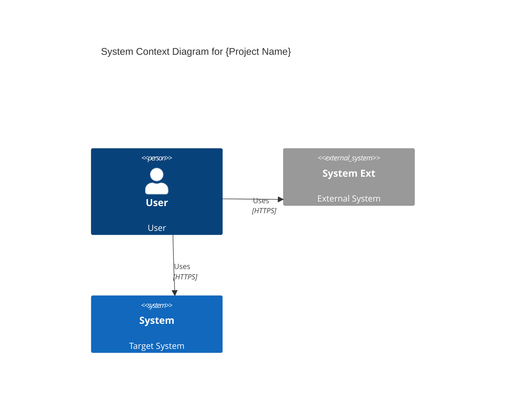

# Agentic Lean Prototyping Spec (ALPS) Template

---

## Section 1. Overview

### 1.1 Purpose

- Briefly describe the overall purpose and overview of the document.

### 1.2 Document Name

- Provide the official name of the document.

---

## Section 2. MVP Goals and Key Metrics

### 2.1 Purpose

- Briefly describe the hypothesis or goals to be validated through the MVP.

<example>
If we provide a 30% discount coupon upon sign-up, the revisit rate within 14 days will increase.
</example>

### 2.2 Key Performance Indicators (KPIs)

- Define the quantitative metrics to evaluate the purpose (hypothesis) stated above.

<example>
Revisit rate within 14 days after sign-up: 30% or higher
</example>

---

## Section 3. Demo Scenario

- Briefly describe the demo scenario that shows how key hypotheses can be validated.
- Ensure the scenario aligns with Section 2.

<example>
1. Amanda visited the shoes category page on our shopping website a week ago.
2. Amanda received a 30% discount coupon via email.
3. Amanda clicks the link in the email, which redirects her to the shoes category page.
4. Amanda buys a pair of shoes using the discount coupon, which is automatically applied to the order.
</example>

---

## Section 4. High-Level Architecture

### 4.1 System Diagram

- Provide Context and Container diagrams (C4 model) illustrating the overall system architecture of the project.
- The Context diagram is essential; the Container diagram is optional.
- Component and Code diagrams are excluded.

<example>

</example>

### 4.2 Technology Stack

- List the key technologies and frameworks to be used in the MVP.

<example>
- Frontend: React (Tailwind CSS)
- Backend: Node.js (Express)
- Database: MongoDB
- Infrastructure: AWS (EC2), GitHub Actions (CI/CD)
</example>

---

## Section 5. Design Specification

- Define the UX guidelines and page flow that will be directly reflected in MVP development.

### 5.1 User Flow and Page Structure

#### 5.1.1 Key Pages (Features)

- List the key pages that must be implemented in the MVP. (Use the same feature IDs as Section 6.1 where applicable.)

<example>
- F3: Main Screen
- F4: Post Creation Screen
- F5: Post List/Detail Screen
</example>

#### 5.1.2 Page Navigation

- Summarize how users navigate between pages and key scenarios.

<example>
1. The user accesses the main screen.
2. Sign-up/Login → Redirects to the main screen upon successful login.
3. View post list → Enter the post details screen → Create a post (Login required).
(Optional) This flow can be visualized using a Mermaid Sequence Diagram.
</example>

---

## Section 6. Requirements Summary

- List all core features (functional requirements) and non-functional requirements for the MVP.
- Each core feature is assigned a unique ID (F1, F2, …), and will be mapped to Section 7.
- Only features defined in this section are included in the MVP scope; additional features must be listed in Section 9.

### 6.1 Core Features (Functional Requirements)

<example>
- F1: Email Sign-up
- F2: Email Login
- F3: Main Screen
- F4: Post Creation
- F5: Post List/Detail
</example>

### 6.2 Non-Functional Requirements

- Define non-functional requirements such as security, performance, and scalability.
- Set the minimum standards for the MVP phase.
- Non-functional requirements are validated through Section 8 (MVP Metrics) or release testing.

<example>
- NF1: Minimum security (no email verification)
- NF2: Performance (up to 1,000 daily users)
- NF3: Latency (under 3 seconds)
- NF4: System stability (99.5% uptime or higher)
</example>

---

## Section 7. Feature-Level Specification

- For every feature listed in Section 6.1, provide a detailed design using the same Fx ID and feature name.
- **Each subsection must match the feature ID and name defined in Section 6.1.**
- No additional features beyond those in Section 6.1 may be specified here.

### 7.1 Feature 1 (F1: Email Sign-up)

#### 7.1.1 User Story

- Describe the user scenario for implementing email sign-up.
- Use this format: `As a [persona], I want to [action], so that [benefit].`

<example>
- As a new user, I want to sign up with my email, so that I can access the service.
- As a user, I enter an email and password and click the "Sign Up" button.
</example>

#### 7.1.2 User Flow

- Describe the user flow for this feature.
- Keep the flow simple and concise.

<example>
1. Display a sign-up form with:
  - Email input field
  - Password input field
  - "Sign Up" button
2. When the user submits the form:
  - Validate input
  - Trigger an API call
  - Redirect to the main screen upon successful sign-up

</example>

#### 7.1.3 Technical Description

- Describe the implementation details from a developer's perspective.
- Break down each user story into detailed technical steps.

<example>
1. Email Validation
  - Validate email format using regex
  - Check for duplicate emails in the database
2. Password Processing
  - Ensure a minimum of 8 characters, including at least one special character
  - Hash the password using bcrypt
3. User Creation Process
  - Insert a new record into the `users` table
  - Generate and return a JWT token
4. Error Handling
  - Return a 400 error for validation failures
  - Return a 500 error for server errors
</example>

---

### 7.2 Feature 2 (F2: Email Login)

#### 7.2.1 User Story

<example>
- As a returning user, I want to log in with my email and password, so that I can access my account.
</example>

#### 7.2.2 User Flow

<example>
1. Display a login form.
2. On submit, validate input, call the login API, redirect to the main screen if successful.
</example>

#### 7.2.3 Technical Description

<example>
1. Email & password validation
2. Password hashing and comparison
3. Token issuance on success
4. Error messages for incorrect credentials or inactive accounts
</example>

---

### 7.3 Feature 3 (F3: Main Screen)

[Continue in the same pattern for all features defined in 6.1.]

---

## Section 8. MVP Metrics

- List the key data points and methods for collecting them to measure the MVP's success.
- Non-functional requirements (from Section 6.2) are also validated here or through dedicated release testing.

<example>
- Number of sign-up button clicks (for F1)
- Number of post creation button clicks (for F4)
- Revisit count within 14 days after last login (for KPI)
- Average response latency (for NF3)
- Uptime logs (for NF4)
</example>

---

## Section 9. Out-of-Scope

- List requirements and features excluded from the MVP.
- If additional features are needed in the future, document them here as a roadmap.

<example>
- OAuth support
- Payment support
- Error logging for post creation
</example>