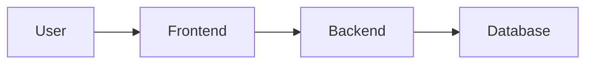

# Agentic Lean Prototyping Spec (ALPS) Template

## Section 1. Overview

### 1.1 Purpose

- Briefly describe the overall purpose and overview of the document.

### 1.2 Document Name

- Provide the official name of the document.

---

## Section 2. MVP Goals and Key Metrics

### 2.1 Purpose

- Briefly describe the hypothesis or goals to be validated through the MVP.

<example>
If we provide a 30% discount coupon upon sign-up, the revisit rate within 14 days will increase
</example>

### 2.2 Key Performance Indicators (KPIs)

- Define the quantitative metrics to evaluate the purpose (hypothesis) stated above.

<example>
Revisit rate within 14 days after sign-up: 30% or higher
</example>

### 2.3 Demo Scenario

- Briefly describe the demo scenario that shows how key hypothesis can be validated.
- Ensure the scenario aligns with Sections 2.1 and 2.2.

<example>
1. Amanda visited the shoes category page on our shopping website a week ago
2. Amanda received a 30% discount coupon via email
3. Amanda clicks the link in the email, which redirects her to the shoes category page
4. Amanda buys a pair of shoes using the discount coupon, which is automatically applied to the order
</example>

---

## Section 3. Requirements Summary

### 3.1 Core Functional Requirements

- Define the essential functionalities that must be implemented in the project.
- Each function is assigned a unique ID (Fx), which must be referenced in Section 6 (Feature-Level Specification)
- The functionalities listed in 3.1 define the upper limit of the development scope; additional features are not included.
- Each core functional requirement (Fx) must be mapped to its corresponding design in Section 6.

<example>
- F1: Sign up via email
- F2: Log in via email
- F3: Simple main screen
- F4: Post creation
- F5: Post details view
...
</example>

### 3.2 Non-Functional Requirements

- Define non-functional requirements such as security, performance, and scalability.
- Set the minimum standards for the MVP phase. Detailed specifications may be elaborated in Section 6 or the Architecture section.

<additional-considerations>
- Requirement IDs
  - Each functional requirement must be assigned a unique ID (F1, F2, …).
  - This ensures easy mapping with Section 6.
- No Additional Features
  - Features not defined in Section 3.1 are excluded from the MVP scope.
  - If additional features are needed, they should be listed in Section 11.
- Requirement-Design Mapping
  - A mapping table linking requirement IDs and design elements is recommended for verification.
</additional-considerations>

<example>
- NF1: Minimum security requirement (No email verification)
- NF2: Performance requirement (Up to 1,000 daily users)
- NF3: Latency (Under 3 seconds)
- NF4: System stability (99.5% uptime or higher)
...
</example>

---

## Section 4. High-Level Architecture

### 4.1 Simple System Diagram

- Provide a high-level diagram illustrating the overall system architecture of the project.

<example>

</example>

### 4.2 Technology Stack

- List the key technologies and frameworks to be used in the MVP.

<example>
- Frontend: React (Tailwind CSS)
- Backend: Node.js (Express)
- Database: MongoDB
- Infrastructure: AWS (EC2), GitHub Actions (CI/CD)
</example>

---

## Section 5. Design Specification

- Define the minimum UI/UX guidelines that will be directly reflected in MVP development.

### 5.1 Screen Structure and User Flow

#### 5.1.1 Key Screens (Pages)

- List the key screens that must be implemented in the MVP.

<example>
- Main Page
- Sign-up/Login Page
- Post Creation Page
- Post Details/List Page
</example>

#### 5.1.2 Screen Navigation

- Summarize how users navigate between screens and key scenarios.

<example>
1. The user accesses the main page.
2. Sign-up/Login → Redirects to the main page upon successful login.
3. View post list → Enter the post details page → Create a post (Login required).
(Optional) This flow can be visualized using a Mermaid Sequence Diagram.
</example>

### 5.2 Page Layout

- Define the layout of the page (header, content, footer).
- Keep the layout simple and express it in a way that could be sketched on paper.
- Exclude font, color, and style-related details.

#### 5.2.1 Page Layout Components

- Each page should follow this standardized layout structure.
- For applications with multiple pages, create separate subsections (5.2.1, 5.2.2, etc.) for each unique layout.

<example>
- Header (Logo, Sign-up/Login button)
  - Logo: Left-aligned, height 40px
  - Login/Sign-up button: Right-aligned, padding 8px 16px

- Main Content (Post list, search bar)

  - Search bar: Centered at the top, width 50%
  - Post List: Grid layout
    - PC: 3-column grid (24px spacing)
    - Tablet: 2-column grid
    - Mobile: 1-column grid
  - Post Card:
    - Thumbnail: 16:9 aspect ratio
    - Title: Limit to 2 lines
    - Summary: Limit to 3 lines

- Footer (Basic links)
  - Height: 60px
  - Links: Left-aligned, 24px spacing
    </example>

#### 5.3 Responsive Design Guidelines

- Define layout adaptations for different viewport sizes
- Specify the primary development approach (mobile-first or desktop-first)
- Document critical breakpoints and their corresponding layout changes

<example>
- Desktop (> 1024px): Three-column grid layout with right-aligned navigation
- Tablet (768px - 1024px): Two-column grid with preserved navigation
- Mobile (< 768px): Single-column layout with condensed navigation bar fixed to top
</example>

---

## Section 6. Feature-Level Specification

- Detail the implementation for each core functional requirement (Fx) from Section 3.1.
- Ensure all requirements in Section 3.1 are covered without introducing additional features.
- Explicitly reference the requirement ID (Fx) in each feature design.

### 6.1 Feature A (F1: Sign up via Email)

#### 6.1.1 User Story

- Describe the user scenario for implementing email sign-up.
- Use following format for each user story: `As a [persona], I [wants to], [so that]`.

<example>
1. As a user, I want to sign up, so I can access the service.
2. As a user, I enter an email and password and click the "Sign Up" button.
</example>

#### 6.1.2 UI Flow

- Describe how this feature appears in the UI.

<example>
1. Display a sign-up form with:
   - Email input field
   - Password input field
   - "Sign Up" button

2. When the user submits the form:
   - Validate input
   - Trigger an API call
   - Redirect to the main page upon successful sign-up
     </example>

#### 6.1.3 Technical Description

- Describe the implementation details from a developer's perspective.
- Break down each user story into detailed technical steps that can be implemented without ambiguity.

<example>
1. Email Validation
   - Validate email format using regex
   - Check for duplicate emails in the database

2. Password Processing

   - Ensure a minimum of 8 characters, including at least one special character
   - Hash the password using bcrypt

3. User Creation Process

   - Insert a new record into the `users` table
   - Generate and return a JWT token

4. Error Handling
   - Return a 400 error for validation failures
   - Return a 409 error for duplicate email conflicts
   - Return a 500 error for server errors
     </example>

#### 6.1.4 Scoped API Specification (Optional)

- Describe the API specifications for this feature.

<example>
User Story: As a user, I want to sign up, so I can access the service.

- Endpoint: POST /api/users
- Request Body:
  {
  "email": string,
  "password": string
  }
- Response Body:
  {
  "userId": string,
  "email": string
  }
  </example>

#### 6.1.5 Scoped Data Model / Schema

- Define the database table/collection schema for this feature.

<example>
**users** table:

- id: PRIMARY KEY
- email: STRING (UNIQUE)
- password: STRING (HASHED)
- createdAt: TIMESTAMP
  </example>

---

## Section 7. Data Model

- This section consolidates the API specifications detailed in Section 6 (Feature-Level Specification).
- Define the database structure or table/collection design for the MVP.

<example>
| Table Name | Description                            | Primary Key (PK) | Foreign Key (FK)      |
|------------|----------------------------------------|------------------|-----------------------|
| User       | Stores authenticated user information  | id               |                       |
| Post       | Stores user-generated posts            | id               | { user_id → User.id } |
| ...        | ...                                    | ...              | ...                   |
</example>

---

## Section 8. API Endpoint Specification

- This section consolidates the API specifications detailed in Section 6 (Feature-Level Specification).
- Define the API Endpoints for the MVP.

<example>
| Endpoint    | Method | Description    | Request Body / Params               | Response                          |
|-------------|--------|----------------|-------------------------------------|-----------------------------------|
| /api/users  | POST   | User sign-up   | { email: string, password: string } | { userId: string, email: string } |
| /api/posts  | POST   | Create a post  | { title: string, content: string }  | { postId: string, title: string } |
| ...         | ...    | ...            | ...                                 | ...                               |
</example>

---

## Section 9. Deployment & Operation

### 9.1 Deployment Method

- Describe the deployment method used for the MVP.

<example>
Deploy via GitHub Actions with automatic deployment to AWS EC2.
</example>

### 9.2 Basic Observability

- List the tools and services used for logging, monitoring, and tracing.

<example>
Logs:
- JSON-structured logs
- AWS CloudWatch for log storage
- AWS CloudWatch Log Insights for querying logs

Monitoring:

- AWS CloudWatch Metrics and Alarms
- CloudWatch Alarms integrated with AWS SNS for Slack notifications on errors

Tracing:

- Amazon X-Ray for application tracing
- Arize Phoenix for LLM request tracing
  </example>

---

## Section 10. MVP Metrics

### 10.1 Data to Collect

- List the key data points to be collected for measuring the MVP's success.

<example>
- Number of sign-up button clicks
- Number of post creation button clicks
- Revisit count within 14 days after login
</example>

---

## Section 11. Out-of-Scope

- Describe out-of-scope requirements for the MVP.

<example>
- Simplified authentication (No OAuth support)
- Minimal error logging for post creation
- Security enhancements planned for future iterations
</example>
