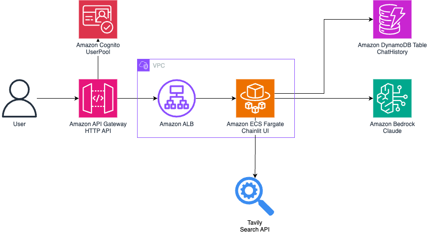

# Alps Writer Infra

This repository contains the CDK infrastructure for the [alps-writer](../app/) app.

Deploying this repository will provision the following architecture in your AWS Account.



## Prerequisite

- Docker
- Node.js 20+

## Installation

1. Install `yarn` globally

```bash
npm i -g yarn
```

2. Install dependencies

```bash
yarn install
```

## Provision the CDK stacks

### Setup Config

1. copy `dev.toml` to `.toml`

```bash
cp config/dev.toml .toml
```

2. edit the `.toml` file

```toml
vim .toml
```

### VPC Setting

> NOTE: If you do not define the `vpc.vpcId` field, CDK will create a new VPC for you.

```toml
[vpc]
vpcId = "vpc-YOUR_VPC_ID"
```

### TavilyAPI for Web Search Feature

1. update `external.web.tavilyApiKey` field. to get api key, visit [tavily.com](https://tavily.com)

```toml
[external.web]
tavilyApiKey = "tvly-YOUR-TAVILY-API-KEY"
```

### Deploy Infrastructure

1. Bootstrap the CDK environment

```bash
npx cdk bootstrap
```

2. Deploy the stacks

```bash
npx cdk deploy "*" --require-approval never --concurrency 2
```

## Usage

### Create New User in Cognito

> MFA is enabled and it is recommended to keep it enabled.

1. Visit the Cognito page in AWS Console

2. Create a new user in the Cognito user pool

### Optional - Self Sign-up

Self sign-up is currently disabled for security reasons. If you want to enable self sign-up, check the Cognito creation part in [AuthStack](./lib/stacks/auth-stack.ts) and change the following property to `true`:

```typescript
const userPool = new cognito.UserPool(this, "UserPool", {
   userPoolName: `${ns}UserPool`,
...
   selfSignUpEnabled: false,
...
```
