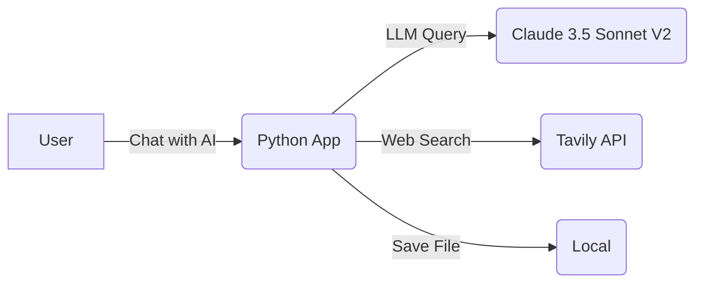

<section_guide number="4" title="High-Level Architecture">
<purpose>C4 모델의 Context, Container 다이어그램으로 시스템 아키텍처 설명</purpose>

<questions>
1. 시스템의 주요 컴포넌트는 무엇인가요?
2. 외부 시스템/서비스 연동은?
3. 기술 스택 선택 이유는?
</questions>

<example>
### 4.1 시스템 구성도

### 4.2 기술 스택
| 구성 요소 | 기술 스택 |
|-----------|-----------|
| 프론트엔드 & 백엔드 | Python (Chainlit) |
| LLM API | Amazon Bedrock, Langchain |
| 웹 검색 API | Tavily API |
</example>

<completion>Context/Container 다이어그램 설명 포함</completion>
</section_guide>
