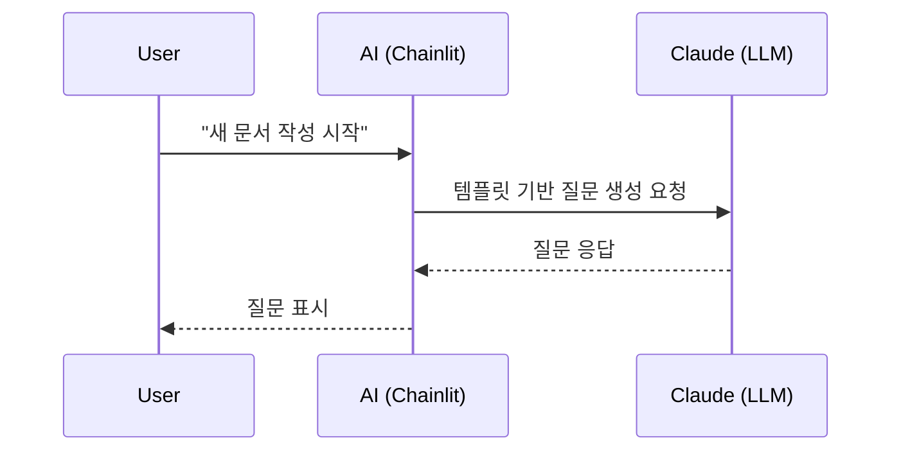

<section_guide number="5" title="Design Specification" references="6">
<purpose>UX, 페이지 플로우, 주요 화면, 사용자 여정 상세화</purpose>

<required_review>
📋 MUST review Section 6 (Requirements Summary) before writing this section.
Call read_alps_section(6) and list Feature IDs (F1, F2...) to use in Key Pages.
</required_review>

<questions>
1. 주요 화면(페이지)은 몇 개인가요?
2. 각 화면의 핵심 기능은? (Section 6의 Feature ID 사용)
3. 화면 간 네비게이션 흐름은?
</questions>

<example>
### 5.1 주요 화면
- **채팅 인터페이스**: 사용자가 AI와 대화하며 문서를 작성하는 메인 화면 (F1, F2)

### 5.2 사용자 흐름

</example>

<completion>주요 화면과 플로우 정의 (Feature ID 매핑 포함)</completion>
</section_guide>
