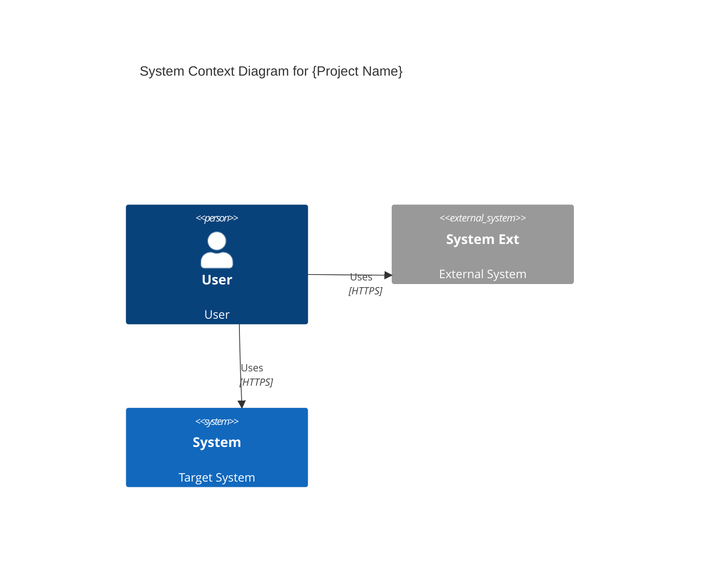

## Section 4. High-Level Architecture

### 4.1 System Diagram

- Provide Context and Container diagrams (C4 model) illustrating the overall system architecture of the project.
- The Context diagram is essential; the Container diagram is optional.
- Component and Code diagrams are excluded.

<example>

</example>

### 4.2 Technology Stack

- List the key technologies and frameworks to be used in the MVP.

<example>
- Frontend: React (Tailwind CSS)
- Backend: Node.js (Express)
- Database: MongoDB
- Infrastructure: AWS (EC2), GitHub Actions (CI/CD)
</example>
